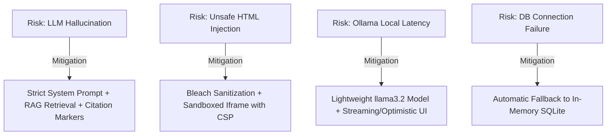

# Product Requirements Document (PRD)
## The Lenny Growth Assistant — Forward Deployment Brief

---

## 1. Executive Summary & Problem Framing

### Primary User
Product Managers (PMs), VPs of Product, Growth Leaders, and Product Marketing Managers who seek authoritative, battle-tested growth and strategy frameworks without spending hours searching through raw audio or unindexed podcast transcripts.

### User Job-to-be-Done (JTBD)
> *"When I am making critical product strategy, organizational, or growth loop decisions, I want to query expert insights from top tech leaders (e.g. Shreyas Doshi, Elena Verna, Brian Chesky, Marty Cagan) and immediately receive grounded recommendations, publication-ready essays, and interactive UI frameworks—without needing to engineer prompts or setup AI infrastructure."*

### Pain Points Removed
- **Unverified AI Hallucinations**: Standard LLMs give generic, generic advice. Lenny Growth Assistant grounds every response strictly in real transcript quotes with clickable source citations.
- **Context Loss & Fragmented Tools**: Users typically copy/paste AI outputs into separate editors. The Assistant includes an **In-App Native Artifact Viewer** (Claude-style) that renders interactive HTML/CSS components and Markdown docs directly beside the chat.
- **Inflexible Infrastructure**: Evaluators or enterprises cannot easily switch between local privacy-first LLMs (Ollama) and cloud APIs (Anthropic/OpenAI). Our multi-LLM configuration layer solves this via zero-code dynamic toggles.

---

## 2. Success Metrics

| Metric | Category | Target | Measurement Method |
| :--- | :--- | :--- | :--- |
| **Grounded Citation Accuracy** | Product / Quality | **100%** of factual claims cite transcript source `[1]`, `[2]` | Automated RAG test suite & human spot-audit |
| **Ship 30 Essay Quality & Length** | Feature / Skill | ~1,250 words with bold lead-ins and tactical frameworks | Pytest string length & structural parser checks |
| **Artifact Rendering Latency** | Performance | **< 300ms** side-by-side drawer load | Frontend performance tracing |
| **Local LLM Readiness** | Operability | **Zero Cloud Credentials Required** for full local Ollama demo | Fresh Docker Compose evaluator verification |

---

## 3. Forward Deployment Brief: Key Decisions

### Assumptions Made
1. **Transcript Format**: Transcripts are semi-structured text. We assumed speaker-turn chunking with metadata (`guest`, `episode_title`, `timestamp`, `url`) produces higher precision retrieval than fixed token windowing.
2. **Local Demo Priority**: Evaluators will run the demo using local Ollama (`llama3.2` or `mistral`). Cloud providers (Anthropic Claude / OpenAI) are provided as optional toggles when API keys are supplied.
3. **Artifact Security**: Generated HTML/CSS artifacts are untrusted. Rendering must occur within a sandboxed `<iframe>` (`sandbox="allow-scripts"`) with strict Content Security Policy (CSP) headers to prevent XSS/CSRF.

### Scope Choices

#### Included in Scope
- **FastAPI Backend API**: Clean RESTful endpoints for chat, sessions, artifacts, providers, and health diagnostics.
- **PostgreSQL / pgvector + SQLite Fallback**: Persistence for sessions, messages, artifacts, citations, and transcript chunks.
- **Dynamic Multi-LLM Layer**: Live switching between Ollama, Anthropic Claude, and OpenAI GPT-4o.
- **Ship 30 for 30 Content Skill**: Dedicated generator encoding Ship 30 writing principles (~1,250 words, hook, narrative progression, bold lead-ins).
- **Native Claude-Style Artifact Viewer**: Side-by-side drawer with preview tab and raw code tab.
- **One-Command Docker Compose**: Orchestrating Postgres, Ollama, FastAPI, and Vite React frontend.

#### Intentionally Excluded & Why
- **User Authentication / OAuth**: Excluded for this deployment phase to streamline evaluator onboarding without login barriers.
- **Voice / Audio Playback**: Excluded to focus resources on text grounding precision and artifact generation.

---

## 4. Risks & Technical Trade-offs

---

## 5. User Flows & Acceptance Criteria

### Flow 1: Grounded PM Question & Citation Verification
1. User enters query: *"How should I structure my product team according to Marty Cagan?"*
2. Assistant retrieves transcript chunks from Marty Cagan's episode.
3. Assistant responds with grounded advice and inline citation badges `[1]`.
4. User clicks `[1]` to open the Citation Drawer showing the exact guest quote, episode title, and timestamp.

### Flow 2: Ship 30 for 30 Essay Generation
1. User clicks "⚡ Ship 30 Essay" quick prompt.
2. System executes `Ship30Skill` using transcript context.
3. Assistant generates a ~1,250 word structured article with bold lead-ins, hook, narrative progression, and actionable takeaway checklist.

### Flow 3: Interactive Artifact Generation & Native Viewer
1. User asks: *"Generate a Product Strategy Canvas dashboard."*
2. Assistant emits a rendered HTML artifact block `<artifact title="..." type="html">`.
3. Frontend detects artifact, automatically opens the right-hand split-pane Artifact Viewer, rendering the sandboxed preview.
