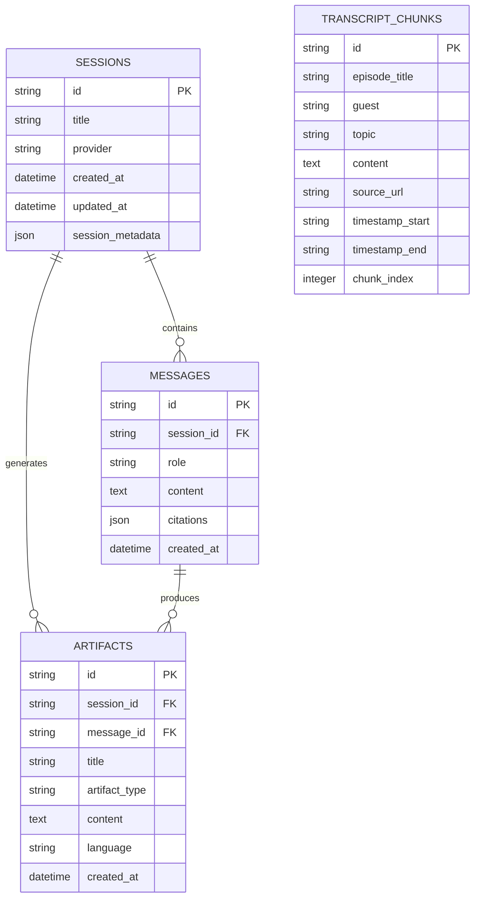

# Architecture Specification — The Lenny Growth Assistant

## 1. System Overview & Component Boundaries

The system is architected as a modular full-stack AI application with a decoupled backend API, dynamic LLM provider factory, RAG vector retrieval engine, and native side-by-side frontend.

```mermaid
graph TB
    subgraph Frontend ["Frontend (Vite + React + TypeScript)"]
        UI[Glassmorphic App UI]
        ChatWin[Chat Window & Citations]
        ArtView[Native Artifact Viewer (Sandboxed Iframe)]
        Store[Zustand State Store]
    end

    subgraph Backend ["Backend API (FastAPI)"]
        Router[API Routers: /chat, /sessions, /artifacts, /providers, /health]
        Agent[Agent Orchestrator]
        RAG[RAG Retrieval Engine]
        Ship30[Ship 30 Content Skill]
        ArtGen[Artifact Generator & Parser]
        Factory[LLM Provider Factory]
    end

    subgraph LLMs ["Dynamic LLM Providers"]
        Ollama[Ollama (Local LLM: llama3.2)]
        Anthropic[Anthropic Claude API]
        OpenAI[OpenAI GPT-4o API]
    end

    subgraph Persistence ["Data Layer"]
        PG[(PostgreSQL / pgvector)]
        SQLite[(SQLite Async Fallback)]
    end

    UI --> Store
    Store --> Router
    Router --> Agent
    Agent --> RAG
    Agent --> Ship30
    Agent --> ArtGen
    Agent --> Factory
    RAG --> PG
    RAG --> SQLite
    Factory --> Ollama
    Factory --> Anthropic
    Factory --> OpenAI
    ArtView -.-> ArtGen
```

---

## 2. Database Schema (Entity Relationship Diagram)



---

## 3. Ingestion & RAG Retrieval Flow

1. **Ingestion (`backend/data/ingest.py`)**:
   - Parses structured transcript dataset (`transcripts_dataset.json`).
   - Normalizes speaker turns into discrete chunks preserving guest name, episode title, timestamp interval, and canonical URL.
   - Populates database table `transcript_chunks`.

2. **RAG Retrieval (`backend/app/core/rag_engine.py`)**:
   - Query term extraction & stop-word filtering.
   - Hybrid scoring based on guest name matching, topic relevance, and term occurrence frequency.
   - Context string formatting with structured citation metadata (`[1]`, `[2]`).

---

## 4. Flexible LLM Provider Configuration

The application uses a **Factory Pattern** (`LLMFactory`) implementing a common `BaseLLMProvider` interface:

```python
class BaseLLMProvider(ABC):
    @abstractmethod
    async def generate(self, messages: List[Dict[str, str]], system_prompt: Optional[str] = None) -> str: pass

    @abstractmethod
    async def is_available(self) -> bool: pass
```

### Supported Providers:
1. **`OllamaProvider`**: Direct HTTP connection to Ollama daemon (`http://localhost:11434`). Default model: `llama3.2`.
2. **`AnthropicProvider`**: Cloud inference using `anthropic.AsyncAnthropic`. Model: `claude-3-5-sonnet`.
3. **`OpenAIProvider`**: Cloud inference using `openai.AsyncOpenAI`. Model: `gpt-4o-mini`.

---

## 5. Security & Isolation Strategy for Artifact Rendering

Treating generated HTML/CSS/JS artifacts as untrusted input requires multi-layered isolation:

```
[ LLM Output ] ──> [ Bleach HTML Sanitizer ] ──> [ CSP Meta Tag Injection ] ──> [ Sandboxed <iframe> ]
```

### Threat Model & Defense Mechanisms:

| Threat Vector | Risk | Mitigation Strategy |
| :--- | :--- | :--- |
| **Cross-Site Scripting (XSS)** | Malicious `<script>` tags executing in host application domain | 1. **Bleach HTML Sanitizer** strips unapproved tags/attributes.<br>2. `iframe` sandbox disables `allow-same-origin`, blocking access to host DOM/localStorage. |
| **Data Exfiltration / CSRF** | Rendered code sending requests to external domains | **Content Security Policy (CSP)** meta tag restricts script/style origins to pre-approved CDNs (`fonts.googleapis.com`). |
| **Top Navigation Hijack** | Artifact redirecting parent page | Sandbox attribute omits `allow-top-navigation`, keeping parent window untouched. |

---

## 6. API Specifications

- `POST /api/v1/chat/message`: Main conversational & skill execution endpoint.
- `GET /api/v1/sessions`: List active chat sessions.
- `POST /api/v1/sessions`: Create new session.
- `GET /api/v1/sessions/{id}`: Retrieve session history with citations and artifacts.
- `GET /api/v1/artifacts/{id}`: Fetch artifact source code.
- `GET /api/v1/providers`: Retrieve active LLM provider status & model availability.
- `POST /api/v1/providers/toggle`: Switch active provider dynamically.
- `GET /api/v1/health`: System health diagnostic endpoint.
